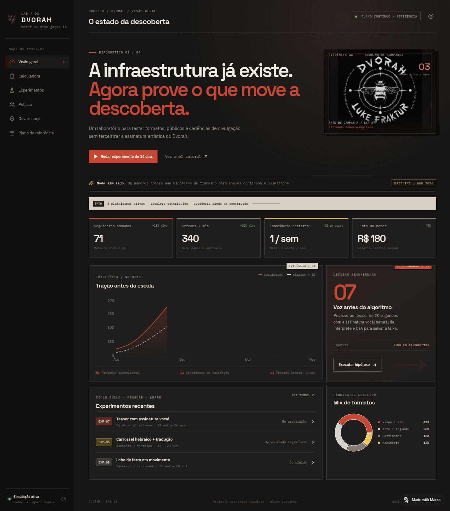
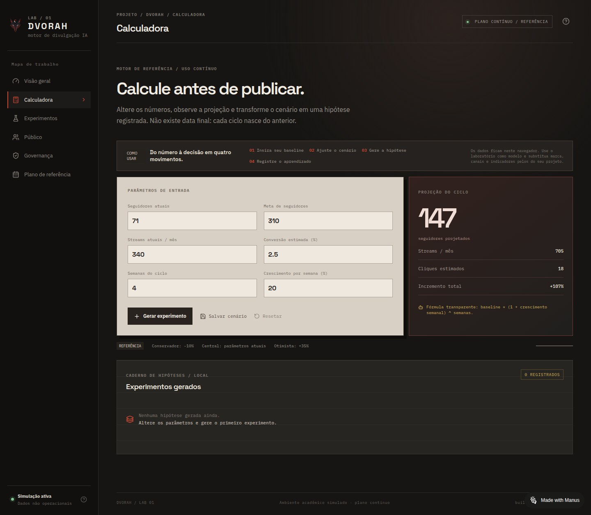
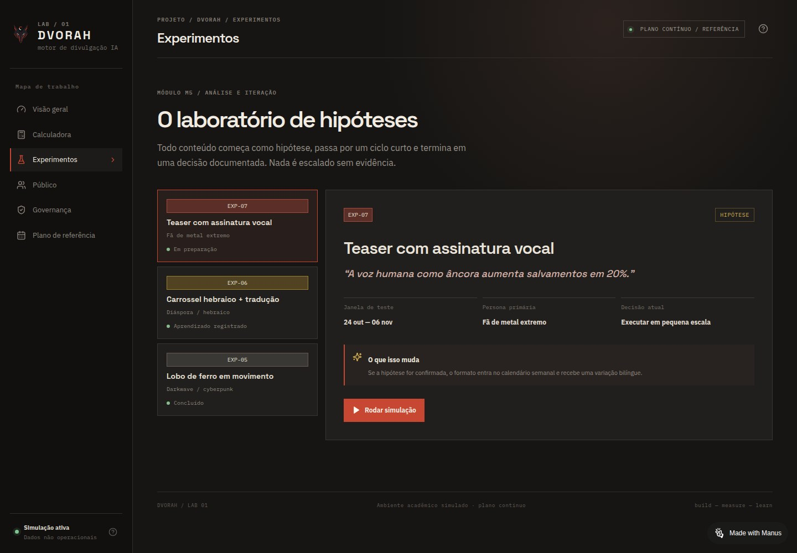
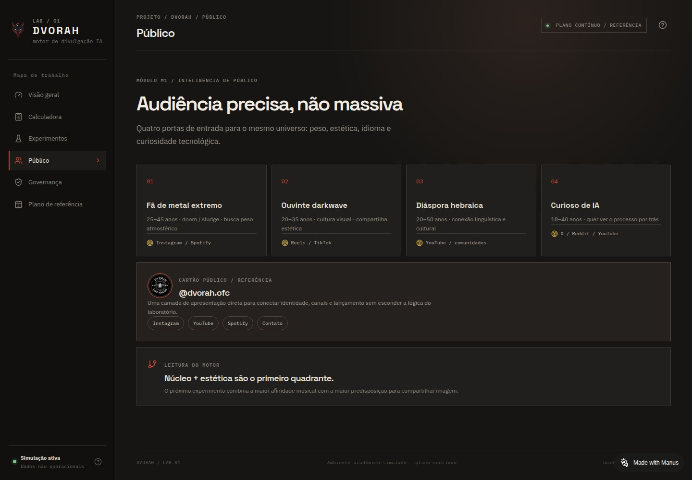
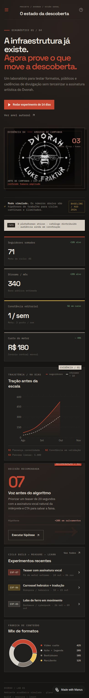

# Dvorah — Motor de Divulgação IA

> **Laboratório web de simulação contínua para planejamento, experimentação e análise de divulgação musical assistida por IA.**

[](https://dvorahai-ezadihcd.manus.space)
[](#contexto-acadêmico)
[](LICENSE)

**Aplicação publicada:** [dvorahai-ezadihcd.manus.space](https://dvorahai-ezadihcd.manus.space)

## Galeria do laboratório

As imagens abaixo são capturas da aplicação publicada e mostram os principais monitores do laboratório. Os valores exibidos são demonstrativos e permanecem identificados como simulações.

| Visão geral | Calculadora contínua |
|---|---|
|  |  |

| Caderno de experimentos | Inteligência de público |
|---|---|
|  |  |

### Comportamento responsivo

O dashboard também foi verificado em viewport mobile, preservando a leitura vertical dos cartões, a imagem de campanha e os indicadores.



Para consultar os critérios, comandos e resultados registrados, veja [Testes técnicos e evidências de validação](docs/testes-tecnicos.md).

## Sobre o projeto

O Dvorah — Motor de Divulgação IA é uma extensão prática de um projeto universitário de inovação desenvolvido no **Curso Superior de Tecnologia em Inteligência Artificial**, na disciplina de **Projetos Inovadores**.

A aplicação transforma um plano teórico de divulgação musical em um ambiente reutilizável de laboratório. Em vez de operar como um calendário fechado, o sistema funciona como uma **calculadora contínua**: a pessoa pode inserir dados, simular cenários, registrar hipóteses, comparar projeções e documentar decisões por tempo indeterminado.

O foco não é prometer crescimento de audiência. O foco é tornar o processo de experimentação mais explícito, rastreável e didático.

## O que o laboratório oferece

- **Dashboard de orientação:** visão geral do método, indicadores e próximos passos.
- **Calculadora de cenários:** projeções conservadora, central e otimista a partir de parâmetros editáveis.
- **Simulação de métricas:** seguidores, streams, cliques e demais sinais de descoberta em um modelo didático.
- **Caderno de experimentos:** registro de hipóteses, formatos, métricas, aprendizados e decisões.
- **Cartão público:** apresentação visual da identidade do projeto e dos canais oficiais.
- **Governança autoral:** separação entre sugestão automatizada, revisão humana e decisão de publicação.
- **Persistência local:** os cenários e registros ficam salvos no navegador por meio de `localStorage`.

## Método de uso

1. Defina um ponto de partida com os dados observados ou com um conjunto didático.
2. Ajuste os parâmetros da calculadora.
3. Compare os cenários e registre quais hipóteses foram testadas.
4. Execute a ação real fora do laboratório, quando aplicável.
5. Retorne com os dados observados e documente o resultado.
6. Tome uma decisão: manter, adaptar ou arquivar.
7. Inicie um novo ciclo sem limite de datas.

> **Importante:** os números de demonstração são simulados. Eles não representam resultados reais, não constituem promessa de audiência ou receita e não substituem dados nativos das plataformas.

## Contexto acadêmico

Este repositório é uma **publicação técnica complementar**, não o relatório acadêmico completo. O trabalho está identificado publicamente como projeto universitário para preservar seu enquadramento e evitar que a aplicação seja confundida com um produto comercial validado.

A extensão prática investiga a seguinte questão:

> Como um pipeline de conteúdo humano-ampliado, organizado pelo ciclo construir–medir–aprender, pode reduzir o custo de testar hipóteses de divulgação musical sem transferir decisões autorais para a IA?

A classificação proposta é de **inovação incremental em marketing e comunicação musical**, pois a contribuição está na combinação de calculadora de cenários, registro de experimentos, supervisão humana e aprendizagem contínua.

### Limites metodológicos

- O laboratório não coleta dados automaticamente das plataformas.
- A simulação não prova causalidade nem eficácia de uma campanha real.
- Mudanças de algoritmo, tamanho da audiência e diferenças entre plataformas limitam comparações diretas.
- IA pode apoiar organização e geração de alternativas, mas não deve aprovar composição, letra, tradução final, voz, identidade visual ou lançamento.
- Dados simulados devem permanecer identificados como simulados e nunca ser misturados com resultados observados.

## Stack técnica

- React 19
- TypeScript
- Vite
- Tailwind CSS 4
- Lucide React
- Recharts
- Wouter
- `localStorage` para persistência local
- Manus WebDev para desenvolvimento e publicação

## Execução local

Requisitos: Node.js 22+ e pnpm.

```bash
pnpm install
pnpm dev
```

Para validar o projeto:

```bash
pnpm check
pnpm build
```

O servidor de desenvolvimento fica disponível em `http://localhost:3000`.

## Estrutura principal

```text
client/src/pages/Home.tsx     # Dashboard, calculadora e estados do laboratório
client/src/index.css          # Sistema visual Oficina Editorial
client/src/App.tsx            # Roteamento e composição da aplicação
data/simulacao.json           # Modelo estruturado de dados simulados
docs/                         # Documentação metodológica e de identidade
```

## Identidade e referência visual

A interface foi inspirada na apresentação pública do projeto Dvorah, especialmente no cartão Linktree oficial: experiência mobile-first, fundo escuro, avatar circular, cartões de ação, canais musicais e linguagem underground/industrial.

A referência visual foi usada como base de design, não como substituição da camada acadêmica. O laboratório mantém uma distinção entre:

- **Cartão público:** comunicação da identidade artística.
- **Laboratório:** método, hipóteses, métricas, governança e documentação.

## Reutilização como template

O projeto foi pensado como um ponto de partida para outros estudantes e criadores. Para adaptar a aplicação:

1. substitua nome, avatar, cores e links do cartão público;
2. mantenha explícita a origem e a natureza simulada dos dados;
3. escreva uma hipótese verificável para cada experimento;
4. registre métricas observadas separadamente das projeções;
5. preserve a aprovação humana nas decisões autorais;
6. documente o que foi alterado no README e no histórico Git.

## Documentação

- [Plano reformulado e implementável](docs/plano-reformulado.md)
- [Referência visual do cartão Linktree](referencia-linktree.md)
- [Nota acadêmica e limites de divulgação](docs/NOTA-ACADEMICA.md)
- [Testes técnicos e evidências de validação](docs/testes-tecnicos.md)

## Autoria e créditos

- **Projeto:** Dvorah — Motor de Divulgação IA
- **Autor acadêmico:** Lucas
- **Natureza:** trabalho universitário em desenvolvimento, com laboratório web como extensão prática
- **Implementação:** React/TypeScript em ambiente Manus WebDev
- **Publicação do laboratório:** Manus Spaces

## Licença

O código é disponibilizado sob a licença MIT. A licença do código não altera direitos sobre músicas, letras, vozes, imagens, marcas, identidades ou demais ativos artísticos associados ao projeto Dvorah.
